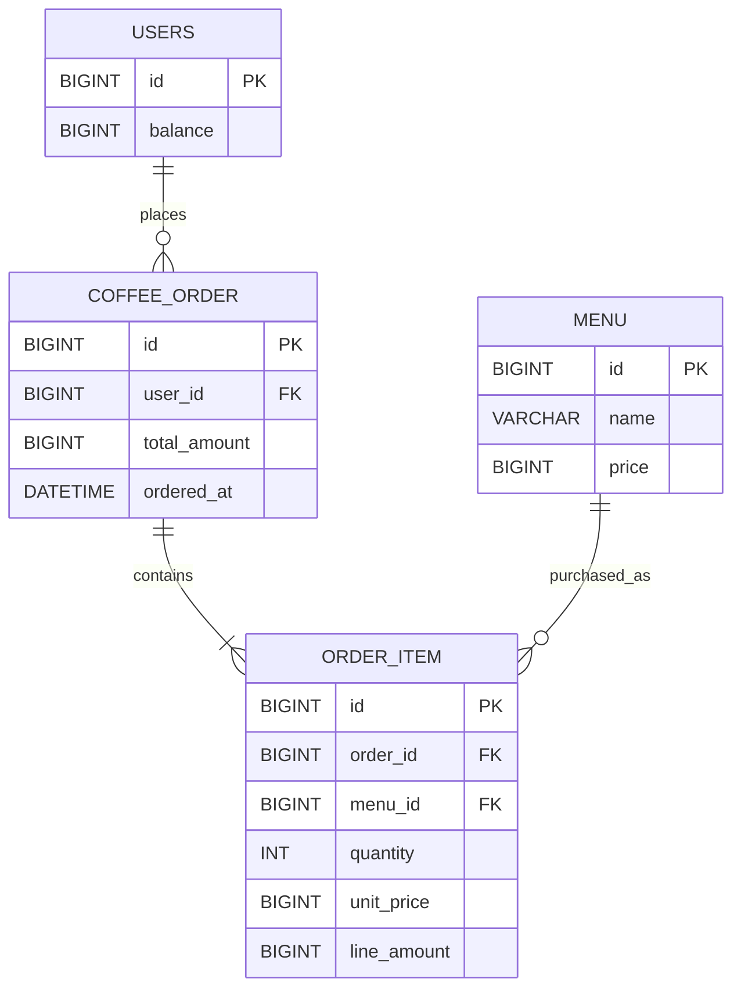
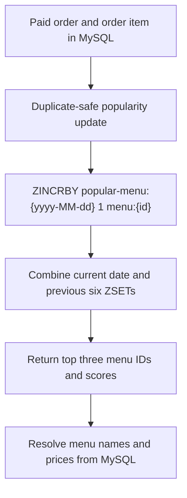

# Coffee Order System Entity Relationship Diagram

## 1. Scope

This document defines the POS-oriented data model described in [`PRD.md`](PRD.md). MySQL is the source of truth for users, menus, orders, and order items. Redis stores the rebuildable popular-menu view separately from the relational model.

The physical table name `coffee_order` is used instead of `order` because `ORDER` is an SQL keyword.

## 2. Relational ER Diagram



## 3. Relational Tables

### `users`

| Column    | Type     | Constraints                    | Description                                             |
|-----------|----------|--------------------------------|---------------------------------------------------------|
| `id`      | `BIGINT` | Primary key                    | User identifier accepted by the point and order APIs.   |
| `balance` | `BIGINT` | Not null, check `balance >= 0` | Current point balance. One Korean won equals one point. |

### `menu`

| Column  | Type      | Constraints                 | Description                                         |
|---------|-----------|-----------------------------|-----------------------------------------------------|
| `id`    | `BIGINT`  | Primary key                 | Menu identifier used by ordering and Redis ranking. |
| `name`  | `VARCHAR` | Not null                    | Coffee menu name.                                   |
| `price` | `BIGINT`  | Not null, check `price > 0` | Current menu price in Korean won and points.        |

### `coffee_order`

| Column         | Type       | Constraints                         | Description                                                |
|----------------|------------|-------------------------------------|------------------------------------------------------------|
| `id`           | `BIGINT`   | Primary key                         | Completed POS order identifier.                            |
| `user_id`      | `BIGINT`   | Not null, foreign key to `users.id` | User who placed and paid for the order.                    |
| `total_amount` | `BIGINT`   | Not null, check `total_amount > 0`  | Total points deducted for the order.                       |
| `ordered_at`   | `DATETIME` | Not null                            | Payment completion time and popularity-bucket date source. |

### `order_item`

| Column        | Type     | Constraints                                | Description                                            |
|---------------|----------|--------------------------------------------|--------------------------------------------------------|
| `id`          | `BIGINT` | Primary key                                | Order-line identifier.                                 |
| `order_id`    | `BIGINT` | Not null, foreign key to `coffee_order.id` | Parent order.                                          |
| `menu_id`     | `BIGINT` | Not null, foreign key to `menu.id`         | Purchased menu.                                        |
| `quantity`    | `INT`    | Not null, check `quantity > 0`             | Purchased quantity. The current API always stores `1`. |
| `unit_price`  | `BIGINT` | Not null, check `unit_price > 0`           | Menu price captured at payment time.                   |
| `line_amount` | `BIGINT` | Not null, check `line_amount > 0`          | `unit_price * quantity` captured at payment time.      |

## 4. Relationship and Consistency Rules

- A user may place many orders.
- Every order belongs to exactly one user.
- An order contains one or more order items.
- A menu may be referenced by many order items.
- The current API accepts one `menuId`, so each order initially contains exactly one order item with quantity `1`.
- `order_item.line_amount` must equal `order_item.unit_price * order_item.quantity`.
- `coffee_order.total_amount` must equal the sum of its order-item line amounts.
- Point deduction, order creation, and order-item creation must succeed or fail in one database transaction.
- Only successfully paid orders are persisted.
- `users.balance` must never become negative, including under concurrent requests from multiple application instances.

The ERD defines these invariants without selecting an optimistic or pessimistic locking mechanism. The technical design must choose and test a concurrency strategy that preserves them.

## 5. External Data Collection Payload

The data collection platform is not part of the relational model. After a successful payment, the application builds the required payload from the persisted order and its item and sends it in near real time.

```json
{
  "userId": 1,
  "menuId": 10,
  "paymentAmount": 4500
}
```

The current requirements do not require a separate delivery-event table for this transmission. A durable outbox may be introduced later as a technical reliability mechanism without changing the core domain relationships.

## 6. Redis Popular Menu View

The popular-menu view is not a relational table. It is a Redis ZSET projection derived from successfully paid orders and order items.

| Redis Element   | Definition                                                                               |
|-----------------|------------------------------------------------------------------------------------------|
| Key             | `popular-menu:{yyyy-MM-dd}`                                                              |
| Type            | ZSET                                                                                     |
| Member          | Stable `menuId`, represented as `menu:{id}`                                              |
| Score           | Successfully paid order count for that menu on the key's date                            |
| TTL             | Fixed expiration on the entire daily ZSET key after it leaves the seven-day query window |
| Source of truth | `coffee_order` and `order_item` records in MySQL                                         |



Each successfully paid order item must increment the selected menu exactly once. A missing or inconsistent Redis projection must be rebuildable from MySQL. TTL applies to the daily ZSET key, not to individual menu members.
