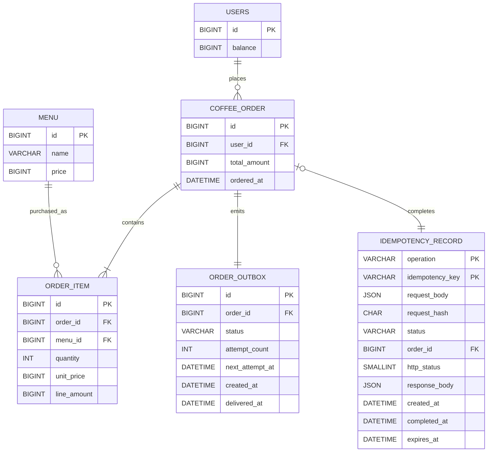
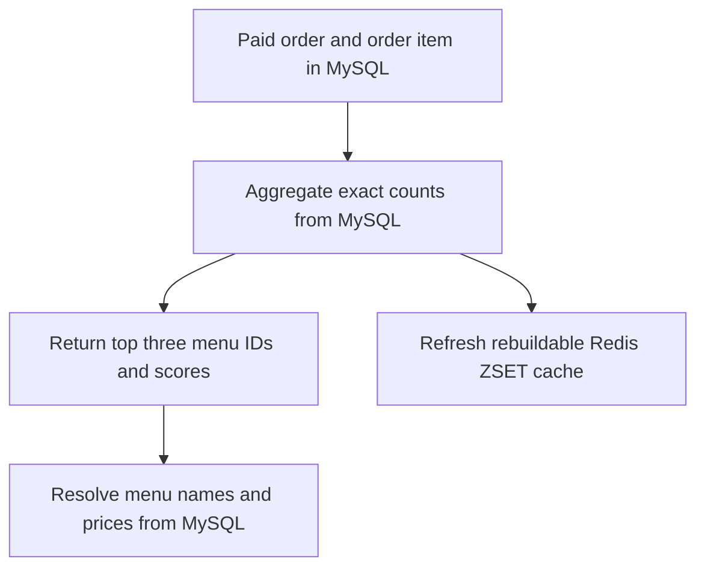

# Coffee Order System Entity Relationship Diagram

## 1. Scope

This document defines the POS-oriented data model described in [`PRD.md`](PRD.md). MySQL is the source of truth for users, menus, orders, and order items. Redis stores the rebuildable popular-menu view separately from the relational model.

The physical table name `coffee_order` is used instead of `order` because `ORDER` is an SQL keyword.

## 2. Relational ER Diagram



## 3. Relational Tables

### `users`

| Column    | Type     | Constraints                    | Description                                             |
|-----------|----------|--------------------------------|---------------------------------------------------------|
| `id`      | `BIGINT` | Primary key                    | User identifier accepted by the point and order APIs.   |
| `balance` | `BIGINT` | Not null, check `balance >= 0` | Current point balance. One Korean won equals one point. |

### `menu`

| Column  | Type      | Constraints                 | Description                                         |
|---------|-----------|-----------------------------|-----------------------------------------------------|
| `id`    | `BIGINT`  | Primary key                 | Menu identifier used by ordering and Redis ranking. |
| `name`  | `VARCHAR` | Not null                    | Coffee menu name.                                   |
| `price` | `BIGINT`  | Not null, check `price > 0` | Current menu price in Korean won and points.        |

### `coffee_order`

| Column         | Type       | Constraints                         | Description                                                |
|----------------|------------|-------------------------------------|------------------------------------------------------------|
| `id`           | `BIGINT`   | Primary key                         | Completed POS order identifier.                            |
| `user_id`      | `BIGINT`   | Not null, foreign key to `users.id` | User who placed and paid for the order.                    |
| `total_amount` | `BIGINT`   | Not null, check `total_amount > 0`  | Total points deducted for the order.                       |
| `ordered_at`   | `DATETIME` | Not null                            | Payment completion time and popularity-bucket date source. |

### `order_item`

| Column        | Type     | Constraints                                | Description                                            |
|---------------|----------|--------------------------------------------|--------------------------------------------------------|
| `id`          | `BIGINT` | Primary key                                | Order-line identifier.                                 |
| `order_id`    | `BIGINT` | Not null, foreign key to `coffee_order.id` | Parent order.                                          |
| `menu_id`     | `BIGINT` | Not null, foreign key to `menu.id`         | Purchased menu.                                        |
| `quantity`    | `INT`    | Not null, check `quantity > 0`             | Purchased quantity. The current API always stores `1`. |
| `unit_price`  | `BIGINT` | Not null, check `unit_price > 0`           | Menu price captured at payment time.                   |
| `line_amount` | `BIGINT` | Not null, check `line_amount > 0`          | `unit_price * quantity` captured at payment time.      |

### `idempotency_record`

This technical table stores point-charge idempotency results and server-managed order attempts so that retries remain safe across application instances and process restarts.

| Column            | Type           | Constraints                                              | Description                                                                |
|-------------------|----------------|----------------------------------------------------------|----------------------------------------------------------------------------|
| `operation`       | `VARCHAR(64)`  | Composite primary key, `POINT_CHARGE` or `ORDER_ATTEMPT` | Idempotency operation                                                      |
| `idempotency_key` | `VARCHAR(128)` | Composite primary key, non-blank ASCII                   | Client key for a point charge or server-generated order-attempt identifier |
| `request_body`    | `JSON`         | Not null                                                 | Immutable canonical request needed to validate or resume the operation     |
| `request_hash`    | `CHAR(64)`     | Not null, lowercase hexadecimal SHA-256                  | Fingerprint of the canonical request                                       |
| `status`          | `VARCHAR(16)`  | Not null, `PENDING` or `COMPLETED`                       | Current operation state                                                    |
| `order_id`        | `BIGINT`       | Nullable, unique, foreign key to `coffee_order.id`       | Completed order; absent for pending attempts and point charges             |
| `http_status`     | `SMALLINT`     | Nullable                                                 | Original successful HTTP status                                            |
| `response_body`   | `JSON`         | Nullable                                                 | Original successful common response body                                   |
| `created_at`      | `DATETIME`     | Not null                                                 | Time at which the record was created                                       |
| `completed_at`    | `DATETIME`     | Nullable                                                 | Time at which the operation and result committed                           |
| `expires_at`      | `DATETIME`     | Not null                                                 | Earliest time at which the applicable record may be removed or rejected    |

The following conditional constraints are part of the physical model:

- A `PENDING` record has null `order_id`, `http_status`, `response_body`, and `completed_at`.
- A `COMPLETED` record has non-null `http_status`, `response_body`, and `completed_at`.
- A `COMPLETED` `ORDER_ATTEMPT` has a non-null `order_id`.
- A `POINT_CHARGE` always has a null `order_id`, including when it is `COMPLETED`.
- `expires_at` for a completed result is at least 24 hours after `completed_at` and is extended during completion when necessary. A pending attempt remains available until its declared `expires_at`.

The point-charge side effect and its completed record must commit in the same transaction. An order attempt is first committed as `PENDING`; confirmation locks that record and atomically commits point deduction, the order, its item, its outbox task, and the transition to `COMPLETED`. A rolled-back confirmation leaves the existing attempt `PENDING`.

### `order_outbox`

This technical table stores one durable data-collection delivery task for each committed order.

| Column            | Type          | Constraints                                        | Description                                            |
|-------------------|---------------|----------------------------------------------------|--------------------------------------------------------|
| `id`              | `BIGINT`      | Primary key                                        | Delivery-task identifier                               |
| `order_id`        | `BIGINT`      | Not null, unique, foreign key to `coffee_order.id` | Source order and external delivery idempotency key     |
| `status`          | `VARCHAR(16)` | Not null, `PENDING` or `DELIVERED`                 | Current delivery state                                 |
| `attempt_count`   | `INT`         | Not null, check `attempt_count >= 0`               | Number of delivery attempts                            |
| `next_attempt_at` | `DATETIME`    | Nullable                                           | Time at which a failed task becomes eligible for retry |
| `created_at`      | `DATETIME`    | Not null                                           | Time at which the order and task committed             |
| `delivered_at`    | `DATETIME`    | Nullable                                           | Time at which the collector acknowledged the delivery  |

The order and its outbox task must commit in the same database transaction. The outbox stores only `order_id`; it does not duplicate the payload as JSON. A worker builds the payload from the immutable `coffee_order` and `order_item` rows, retries `PENDING` tasks until the collector acknowledges them, and then marks them `DELIVERED`.

## 4. Relationship and Consistency Rules

- A user may place many orders.
- Every order belongs to exactly one user.
- An order contains one or more order items.
- A menu may be referenced by many order items.
- The current API accepts one `menuId`, so each order initially contains exactly one order item with quantity `1`.
- `order_item.line_amount` must equal `order_item.unit_price * order_item.quantity`.
- `coffee_order.total_amount` must equal the sum of its order-item line amounts.
- Point deduction, order creation, and order-item creation must succeed or fail in one database transaction.
- A successful mutation and its completed idempotency result must succeed or fail in one database transaction.
- Every committed order has exactly one completed `ORDER_ATTEMPT` idempotency record.
- Every committed order has exactly one `order_outbox` task, created in the order transaction.
- Only successfully paid orders are persisted.
- Completed orders and their order items are immutable and remain available while an outbox task references them.
- `users.balance` must never become negative, including under concurrent requests from multiple application instances.

The ERD defines these invariants without selecting an optimistic or pessimistic locking mechanism. The technical design must choose and test a concurrency strategy that preserves them.

## 5. External Data Collection Payload

The data collection platform is not part of the relational model. After a successful payment, the application uses `order_outbox.order_id` to read the persisted immutable order and its item, builds the required payload, and sends it in near real time.

```json
{
  "orderId": 1001,
  "userId": 1,
  "menuId": 10,
  "paymentAmount": 4500
}
```

The application delivers the payload at least once and retries it from `order_outbox` until the data collection platform acknowledges it. This provides eventual delivery when the platform eventually becomes available. The collector uses `orderId` as the idempotency key and ignores a payload that it has already processed. The outbox is a technical reliability mechanism and does not change the core domain relationships.

## 6. Redis Popular Menu View

The popular-menu view is not a relational table. It is a Redis ZSET projection derived from successfully paid orders and order items.

| Redis Element   | Definition                                                                               |
|-----------------|------------------------------------------------------------------------------------------|
| Key             | `popular-menu:{yyyy-MM-dd}`                                                              |
| Type            | ZSET                                                                                     |
| Member          | Stable `menuId`, represented as `menu:{id}`                                              |
| Score           | Successfully paid order count for that menu on the key's date                            |
| TTL             | Fixed expiration on the entire daily ZSET key after it leaves the seven-day query window |
| Source of truth | `coffee_order` and `order_item` records in MySQL                                         |



The application must calculate each popular-menu response from a MySQL aggregation of paid orders and order items in the requested period. Redis ZSETs are a rebuildable cache of that aggregation and must not be the authoritative source for an API response. A missing or inconsistent cache is rebuilt from MySQL without changing the returned counts. TTL applies to the daily ZSET key, not to individual menu members.
