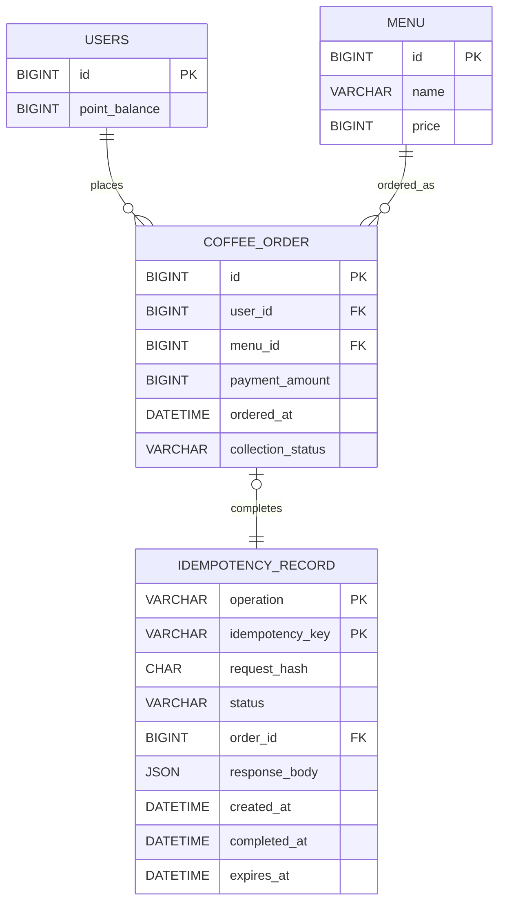

# Coffee Order System Entity Relationship Diagram

## 1. Scope

MySQL is the source of truth for users, menus, paid orders, and idempotency
records. The current API accepts one `menuId` for each order, so an order is a
single-menu purchase. There is no cart or order-item table in the baseline
model. Redis stores a rebuildable popularity projection outside the relational
model.

## 2. Relational ER Diagram

## 3. Tables

### `users`

| Column | Type | Constraints | Description |
|---|---|---|---|
| `id` | `BIGINT` | Primary key | User identifier accepted by point and order APIs |
| `point_balance` | `BIGINT` | Not null, check `point_balance >= 0` | Current available points |

### `menu`

| Column | Type | Constraints | Description |
|---|---|---|---|
| `id` | `BIGINT` | Primary key | Menu identifier |
| `name` | `VARCHAR` | Not null | Menu name |
| `price` | `BIGINT` | Not null, check `price > 0` | Current menu price in Korean won and points |

### `coffee_order`

`coffee_order` is used because `ORDER` is an SQL keyword.

| Column | Type | Constraints | Description |
|---|---|---|---|
| `id` | `BIGINT` | Primary key | Paid-order identifier |
| `user_id` | `BIGINT` | Not null, foreign key to `users.id` | User who paid for the order |
| `menu_id` | `BIGINT` | Not null, foreign key to `menu.id` | Purchased menu |
| `payment_amount` | `BIGINT` | Not null, check `payment_amount > 0` | Points deducted at payment time |
| `ordered_at` | `DATETIME` | Not null | Payment completion time used by popularity queries |
| `collection_status` | `VARCHAR(16)` | Not null: `PENDING` or `SUCCEEDED` | Whether order data still requires delivery to the collection platform |

Recommended index: `(ordered_at, menu_id)` for the seven-day popularity
aggregation. An index on `collection_status` may be added if the pending-order
retry scan requires it at production volume.

An order is created with `collection_status = PENDING` in the same transaction
as payment. A successful call changes it to `SUCCEEDED`. A failed call leaves
it `PENDING`, and the retry scheduler attempts pending orders again on its next
run. Delivery is at-least-once: multiple application instances can send the
same pending order, so the collection platform must deduplicate by order ID.

### `idempotency_record`

This technical table makes point charges and payments safe to retry across
multiple instances. It stores one record per operation and client key.

| Column | Type | Constraints | Description |
|---|---|---|---|
| `operation` | `VARCHAR(32)` | Composite primary key: `POINT_CHARGE` or `ORDER_PAYMENT` | Mutation type |
| `idempotency_key` | `VARCHAR(128)` | Composite primary key | Client-supplied retry key |
| `request_hash` | `CHAR(64)` | Not null | SHA-256 hash of the canonical request |
| `status` | `VARCHAR(16)` | Not null: `PENDING` or `COMPLETED` | Processing state |
| `order_id` | `BIGINT` | Nullable, unique, foreign key to `coffee_order.id` | Created order for `ORDER_PAYMENT` |
| `response_body` | `JSON` | Nullable | Original successful response body |
| `created_at` | `DATETIME` | Not null | Record creation time |
| `completed_at` | `DATETIME` | Nullable | Successful completion time |
| `expires_at` | `DATETIME` | Not null | Safe cleanup time |

The database uniqueness constraint on `(operation, idempotency_key)` prevents
concurrent duplicate requests. A request that reuses a key with a different
canonical request is rejected. A completed matching request returns its stored
response without applying a second side effect.

## 4. Consistency Rules

- One Korean won equals one point.
- `users.point_balance` must never become negative.
- Point charging uses an atomic increment in the database.
- Payment uses an atomic conditional decrement, for example `balance >= price`.
- Point deduction, `coffee_order` creation, and idempotency completion run in
  one database transaction.
- A successfully paid order is created with a durable pending collection
  delivery state in that same transaction.
- A failed delivery remains pending. Retries use the order ID as their external
  idempotency identifier.
- Only committed `coffee_order` rows participate in popularity aggregation.
- `payment_amount` is immutable payment history and is not changed when a
  menu's current price changes.

## 5. Redis Popularity Projection

Redis caches popularity counts in one ZSET for each `Asia/Seoul` calendar date.
The cache accelerates the high-traffic popular-menu API; it is never the source
of truth.

| Redis element | Definition |
|---|---|
| Key | `popular-menu:{yyyy-MM-dd}` |
| Type | ZSET |
| Member | `menu:{menuId}` |
| Score | Number of committed paid orders for the menu on that calendar date |
| Projection marker | `popular-menu:projection:{orderId}` prevents a retried projection from incrementing twice |
| Source of truth | `coffee_order` rows in MySQL |

After a payment commits, the application increments the matching daily member
with `ZINCRBY`. A single Redis script creates the order's projection marker
with `SETNX` and increments the score atomically, so a retried event cannot
increment the same order twice. The popular-menu API combines the current day's
key is excluded and the API combines the seven preceding completed daily keys.
If a key is missing, expired unexpectedly, or fails cache validation, the
application aggregates the corresponding MySQL orders and rebuilds the key
before returning the result.
