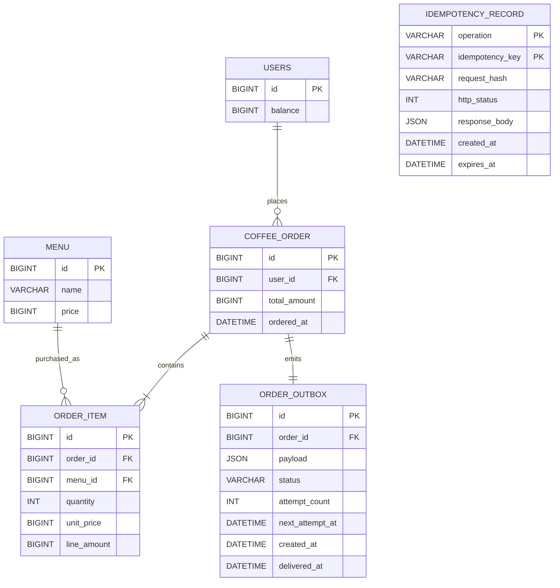
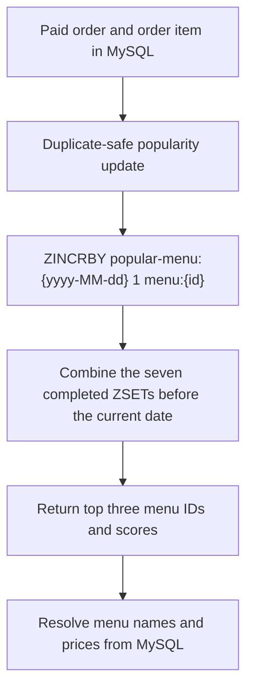

# Coffee Order System Entity Relationship Diagram

## 1. Scope

This document defines the POS-oriented data model described in [`PRD.md`](PRD.md). MySQL is the source of truth for users, menus, orders, and order items. Redis stores the rebuildable popular-menu view separately from the relational model.

The physical table name `coffee_order` is used instead of `order` because `ORDER` is an SQL keyword.

## 2. Relational ER Diagram



## 3. Relational Tables

### `users`

| Column    | Type     | Constraints                    | Description                                             |
|-----------|----------|--------------------------------|---------------------------------------------------------|
| `id`      | `BIGINT` | Primary key                    | User identifier accepted by the point and order APIs.   |
| `balance` | `BIGINT` | Not null, check `balance >= 0` | Current point balance. One Korean won equals one point. |

### `menu`

| Column  | Type      | Constraints                 | Description                                         |
|---------|-----------|-----------------------------|-----------------------------------------------------|
| `id`    | `BIGINT`  | Primary key                 | Menu identifier used by ordering and Redis ranking. |
| `name`  | `VARCHAR` | Not null                    | Coffee menu name.                                   |
| `price` | `BIGINT`  | Not null, check `price > 0` | Current menu price in Korean won and points.        |

### `coffee_order`

| Column         | Type       | Constraints                         | Description                                                |
|----------------|------------|-------------------------------------|------------------------------------------------------------|
| `id`           | `BIGINT`   | Primary key                         | Completed POS order identifier.                            |
| `user_id`      | `BIGINT`   | Not null, foreign key to `users.id` | User who placed and paid for the order.                    |
| `total_amount` | `BIGINT`   | Not null, check `total_amount > 0`  | Total points deducted for the order.                       |
| `ordered_at`   | `DATETIME` | Not null                            | Payment completion time and popularity-bucket date source. |

### `order_item`

| Column        | Type     | Constraints                                | Description                                            |
|---------------|----------|--------------------------------------------|--------------------------------------------------------|
| `id`          | `BIGINT` | Primary key                                | Order-line identifier.                                 |
| `order_id`    | `BIGINT` | Not null, foreign key to `coffee_order.id` | Parent order.                                          |
| `menu_id`     | `BIGINT` | Not null, foreign key to `menu.id`         | Purchased menu.                                        |
| `quantity`    | `INT`    | Not null, check `quantity > 0`             | Purchased quantity. The current API always stores `1`. |
| `unit_price`  | `BIGINT` | Not null, check `unit_price > 0`           | Menu price captured at payment time.                   |
| `line_amount` | `BIGINT` | Not null, check `line_amount > 0`          | `unit_price * quantity` captured at payment time.      |

### `idempotency_record`

This technical table stores successful mutation responses so that client retries remain safe across application instances and process restarts.

| Column            | Type       | Constraints                                | Description                                                |
|-------------------|------------|--------------------------------------------|------------------------------------------------------------|
| `operation`       | `VARCHAR`  | Composite primary key                      | Normalized HTTP method and endpoint path                    |
| `idempotency_key` | `VARCHAR`  | Composite primary key                      | Client-provided idempotency key                             |
| `request_hash`    | `VARCHAR`  | Not null                                   | Stable fingerprint of path parameters and the request body |
| `http_status`     | `INT`      | Not null                                   | Original successful HTTP status                            |
| `response_body`   | `JSON`     | Not null                                   | Original successful response body                          |
| `created_at`      | `DATETIME` | Not null                                   | Time at which the mutation committed                       |
| `expires_at`      | `DATETIME` | Not null, at least 24 hours after creation | Earliest time at which the result may be removed           |

The successful idempotency record must commit in the same database transaction as its point charge or order side effects. A rolled-back mutation must not leave a successful idempotency record.

### `order_outbox`

This technical table stores one durable data-collection delivery event for each committed order.

| Column            | Type       | Constraints                                     | Description                                            |
|-------------------|------------|-------------------------------------------------|--------------------------------------------------------|
| `id`              | `BIGINT`   | Primary key                                     | Delivery-event identifier                              |
| `order_id`        | `BIGINT`   | Not null, unique, foreign key to `coffee_order` | Order identifier and external delivery idempotency key |
| `payload`         | `JSON`     | Not null                                        | Immutable data-collection payload                      |
| `status`          | `VARCHAR`  | Not null, `PENDING` or `DELIVERED`               | Current delivery state                                 |
| `attempt_count`   | `INT`      | Not null, check `attempt_count >= 0`             | Number of delivery attempts                            |
| `next_attempt_at` | `DATETIME` | Nullable                                        | Time at which a failed event becomes eligible for retry |
| `created_at`      | `DATETIME` | Not null                                        | Time at which the order and event committed            |
| `delivered_at`    | `DATETIME` | Nullable                                        | Time at which the collector acknowledged the event     |

The order and its outbox event must commit in the same database transaction. A worker retries `PENDING` events until the collector acknowledges them and then marks them `DELIVERED`.

## 4. Relationship and Consistency Rules

- A user may place many orders.
- Every order belongs to exactly one user.
- An order contains one or more order items.
- A menu may be referenced by many order items.
- The current API accepts one `menuId`, so each order initially contains exactly one order item with quantity `1`.
- `order_item.line_amount` must equal `order_item.unit_price * order_item.quantity`.
- `coffee_order.total_amount` must equal the sum of its order-item line amounts.
- Point deduction, order creation, and order-item creation must succeed or fail in one database transaction.
- A successful mutation and its idempotency result must succeed or fail in one database transaction.
- Every committed order has exactly one `order_outbox` event, created in the order transaction.
- Only successfully paid orders are persisted.
- `users.balance` must never become negative, including under concurrent requests from multiple application instances.

The ERD defines these invariants without selecting an optimistic or pessimistic locking mechanism. The technical design must choose and test a concurrency strategy that preserves them.

## 5. External Data Collection Payload

The data collection platform is not part of the relational model. After a successful payment, the application builds the required payload from the persisted order and its item and sends it in near real time.

```json
{
  "orderId": 1001,
  "userId": 1,
  "menuId": 10,
  "paymentAmount": 4500
}
```

The application delivers the event at least once and retries it from `order_outbox` until the data collection platform acknowledges it. The collector uses `orderId` as the idempotency key and ignores an event that it has already processed. The outbox is a technical reliability mechanism and does not change the core domain relationships.

## 6. Redis Popular Menu View

The popular-menu view is not a relational table. It is a Redis ZSET projection derived from successfully paid orders and order items.

| Redis Element   | Definition                                                                               |
|-----------------|------------------------------------------------------------------------------------------|
| Key             | `popular-menu:{yyyy-MM-dd}`                                                              |
| Type            | ZSET                                                                                     |
| Member          | Stable `menuId`, represented as `menu:{id}`                                              |
| Score           | Successfully paid order count for that menu on the key's date                            |
| TTL             | Fixed expiration on the entire daily ZSET key after it leaves the seven-day query window |
| Source of truth | `coffee_order` and `order_item` records in MySQL                                         |



Each successfully paid order item must increment the selected menu exactly once. A missing or inconsistent Redis projection must be rebuildable from MySQL. TTL applies to the daily ZSET key, not to individual menu members.
