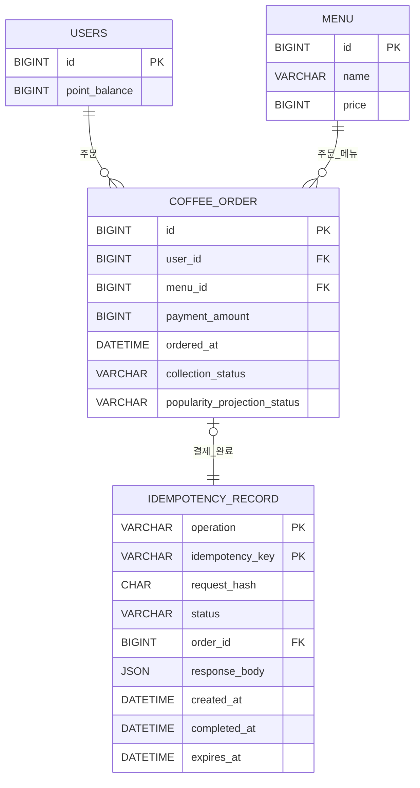

# 커피 주문 시스템 엔터티 관계 다이어그램

> 원문: [English ERD](../ERD.md)

## 1. 범위

MySQL은 사용자, 메뉴, 결제된 주문, 멱등성 기록의 기준 데이터 저장소입니다. 현재 API는 주문당
하나의 `menuId`를 받으므로 주문은 단일 메뉴 구매를 나타냅니다. 기본 모델에는 장바구니나
주문 항목 테이블이 없습니다. Redis는 관계형 모델 밖에서 재구축 가능한 인기 메뉴 projection을
저장합니다.

## 2. 관계형 ER 다이어그램

## 3. 테이블

### `users`

| 컬럼 | 타입 | 제약 조건 | 설명 |
|---|---|---|---|
| `id` | `BIGINT` | 기본 키 | 포인트와 주문 API가 받는 사용자 식별자 |
| `point_balance` | `BIGINT` | Not null, `point_balance >= 0` 검사 | 현재 사용 가능한 포인트 잔액 |

### `menu`

| 컬럼 | 타입 | 제약 조건 | 설명 |
|---|---|---|---|
| `id` | `BIGINT` | 기본 키 | 메뉴 식별자 |
| `name` | `VARCHAR` | Not null | 메뉴 이름 |
| `price` | `BIGINT` | Not null, `price > 0` 검사 | 한국 원화 및 포인트 기준 현재 메뉴 가격 |

### `coffee_order`

`ORDER`는 SQL 예약어이므로 테이블 이름으로 `coffee_order`를 사용합니다.

| 컬럼 | 타입 | 제약 조건 | 설명 |
|---|---|---|---|
| `id` | `BIGINT` | 기본 키 | 결제된 주문 식별자 |
| `user_id` | `BIGINT` | Not null, `users.id` 외래 키 | 결제한 사용자 |
| `menu_id` | `BIGINT` | Not null, `menu.id` 외래 키 | 구매한 메뉴 |
| `payment_amount` | `BIGINT` | Not null, `payment_amount > 0` 검사 | 결제 시 차감한 포인트 |
| `ordered_at` | `DATETIME` | Not null | 인기 메뉴 조회에 사용하는 결제 완료 시각 |
| `collection_status` | `VARCHAR(16)` | Not null: `PENDING` 또는 `SUCCEEDED` | 주문 데이터가 수집 플랫폼으로 전달됐는지 나타내는 상태 |
| `popularity_projection_status` | `VARCHAR(16)` | Not null: `PENDING` 또는 `SUCCEEDED` | 결제 주문이 Redis 일별 인기 메뉴 ZSET에 투영됐는지 나타내는 상태 |

인덱스는 다음과 같습니다.

- `(ordered_at, menu_id)`는 기간·메뉴 기준 7일 인기 메뉴 집계를 지원합니다.
- `(popularity_projection_status, ordered_at, id)`는 날짜별 대기 인기 메뉴 투영을 안정적인 순서로
  찾고, 투영 완료 주문에서 일별 캐시를 재구축하는 작업을 지원합니다.
- 기본 키 `id`는 전송 시도가 비관적으로 잠그는 단일 주문 행을 식별합니다. 별도의
  `collection_status` 인덱스는 현재 스키마에 없으며, 대기 전송 조회가 운영 병목이 될 때 검토합니다.

주문은 결제와 같은 트랜잭션에서 `collection_status = PENDING`으로 생성됩니다. 전송 트랜잭션은
MockAPI.io를 호출하기 전에 아직 `PENDING`인 주문 행을 DB 비관적 잠금으로 가져옵니다. 클라이언트는
먼저 로컬 주문 ID로 외부 `orders` 리소스를 조회합니다. 주문 데이터가 같은 레코드 한 건이 있거나
생성이 성공하면 로컬 상태를 `SUCCEEDED`로 바꾸고, 호출 실패나 충돌이 발생하면 `PENDING`으로 남겨
재시도 스케줄러가 다음 실행에서 다시 시도합니다. 로컬 `coffee_order.id`를 조정 키로 사용하므로
MockAPI.io가 생성한 리소스 `id`는 저장하지 않으며, 외부 연동을 위한 관계형 스키마 변경은 없습니다.

`popularity_projection_status`는 결제 트랜잭션에서 `PENDING`으로 초기화됩니다. 커밋된 주문이
Redis ZSET에 반영된 뒤 `SUCCEEDED`로 바뀝니다. 투영 실패는 재시도를 위해 `PENDING`으로 남습니다.
캐시 재구축은 해당 날짜의 대기 투영을 먼저 완료한 다음 `SUCCEEDED` 주문을 집계하므로, 커밋된
MySQL 주문에서 파생된 캐시를 유지하면서 확인되지 않은 투영을 다시 집계하지 않습니다.

### `idempotency_record`

이 기술 테이블은 포인트 충전과 결제를 여러 인스턴스에서 안전하게 재시도할 수 있게 합니다.
작업 종류와 클라이언트 키마다 하나의 레코드를 저장합니다.

| 컬럼 | 타입 | 제약 조건 | 설명 |
|---|---|---|---|
| `operation` | `VARCHAR(32)` | 복합 기본 키: `POINT_CHARGE` 또는 `ORDER_PAYMENT` | 변경 작업 종류 |
| `idempotency_key` | `VARCHAR(128)` | 복합 기본 키 | 클라이언트가 제공한 재시도 키 |
| `request_hash` | `CHAR(64)` | Not null | 정규 요청의 SHA-256 해시 |
| `status` | `VARCHAR(16)` | Not null: `PENDING` 또는 `COMPLETED` | 처리 상태 |
| `order_id` | `BIGINT` | Nullable, unique, `coffee_order.id` 외래 키 | `ORDER_PAYMENT`가 생성한 주문 |
| `response_body` | `JSON` | Nullable | 최초 성공 응답 본문 |
| `created_at` | `DATETIME` | Not null | 생성 시각 |
| `completed_at` | `DATETIME` | Nullable | 성공 완료 시각 |
| `expires_at` | `DATETIME` | Not null | 안전한 정리 시점 |

`(operation, idempotency_key)`의 DB 유니크 제약은 동시 중복 요청을 막습니다. 같은 키를 다른
정규 요청에 사용하면 거부합니다. 완료된 요청과 같은 요청은 부작용을 다시 적용하지 않고 저장된
응답을 반환합니다.

## 4. 일관성 규칙

- 1원은 1포인트입니다.
- `users.point_balance`는 음수가 될 수 없습니다.
- 포인트 충전은 DB 원자적 증가를 사용합니다.
- 결제는 예를 들어 `balance >= price` 조건을 가진 원자적 감소를 사용합니다.
- 포인트 차감, `coffee_order` 생성, 멱등성 완료는 하나의 DB 트랜잭션에서 실행합니다.
- 성공한 결제 주문은 같은 트랜잭션 안에서 영속적인 대기 수집 전송 상태로 생성됩니다.
- 전송 시도는 MockAPI.io를 호출하기 전에 아직 대기 상태인 주문 행을 비관적으로 잠급니다. 전송
  실패는 대기 상태로 남고 모든 재시도는 생성 전에 로컬 주문 ID로 기존 외부 레코드를 조회합니다.
- 외부 호출 결과와 로컬 `SUCCEEDED` 커밋은 하나의 원자 작업이 아닙니다. 생성 전 조회는
  애플리케이션이 소유한 재시도를 조정하며, 수동 또는 무관한 외부 쓰기는 관계형 일관성 경계 밖에
  있습니다.
- 결제 주문은 `popularity_projection_status = PENDING`으로 시작하고, Redis 투영이 성공해야
  `SUCCEEDED`로 바뀝니다. 실패한 투영은 재시도합니다.
- 커밋된 `coffee_order` 행만 인기 메뉴 집계에 참여합니다.
- `payment_amount`는 변경 불가능한 결제 이력이며 메뉴 현재 가격이 바뀌어도 수정하지 않습니다.

## 5. Redis 인기 메뉴 Projection

Redis는 `Asia/Seoul` 기준 날짜마다 하나의 ZSET에 인기 메뉴 수를 캐시합니다. 이 캐시는
트래픽이 많은 인기 메뉴 API를 빠르게 하지만 기준 데이터가 아닙니다.

| Redis 요소 | 정의 |
|---|---|
| 키 | `popular-menu:{yyyy-MM-dd}` |
| 타입 | ZSET |
| 멤버 | `menu:{menuId}` |
| 점수 | 해당 날짜의 커밋된 메뉴별 주문 횟수 |
| Projection marker | `popular-menu:projection:{orderId}`가 재시도 projection의 중복 증가를 막음 |
| 기준 데이터 | MySQL의 `coffee_order` 행 |

결제 커밋 후 애플리케이션은 `ZINCRBY`로 해당 일자의 메뉴 멤버를 증가시킵니다. 하나의 Redis
스크립트가 `SETNX`로 주문 projection marker를 만들고 점수를 원자적으로 증가시키므로 재시도
이벤트는 같은 주문을 두 번 증가시킬 수 없습니다. 스크립트가 완료된 뒤
`popularity_projection_status`는 `PENDING`에서 `SUCCEEDED`로 바뀌며, 스크립트 또는 영속화
실패는 상태를 대기로 남겨 재시도합니다. 인기 메뉴 API는 현재 날짜를 제외한 직전 완료 7일 키를
합산합니다. 키가 없거나 예상치 않게 만료됐거나 캐시 검증에 실패하면 해당 날짜의 대기 투영을
먼저 완료한 다음 `SUCCEEDED` MySQL 주문을 집계해 키를 재구축합니다.
